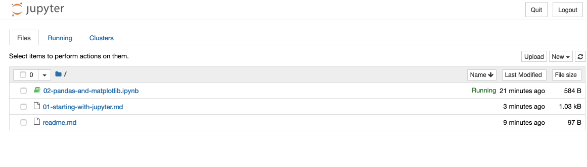

# Getting Started With Jupyter

Refer to the instructions in the previous class for creating/activating a virtual environment using `venv`. Then, once you have a virtual environment activated run:

```
pip install jupyter pandas matplotlib
```

Then, activate Jupyter notebook from the directory containing this file:

```
jupyter notebook
```

A browser window should open automatically on a page that looks something like this:



